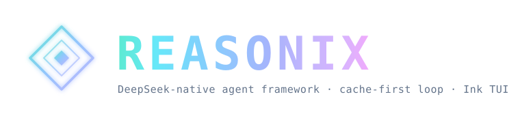

<p align="center">
  
</p>

<p align="center">
  <a href="./README.md">English</a>
  &nbsp;·&nbsp;
  <strong>简体中文</strong>
  &nbsp;·&nbsp;
  <a href="./docs/SPEC.md">Spec</a>
</p>

> [!IMPORTANT]
> **Reasonix 1.0 已用 Go 完全重写** — 本分支（`main-v2`）是新的默认开发分支。

<h3 align="center">一个 DeepSeek 原生的 AI 编码助手</h3>
<p align="center">配置驱动 + 插件化的单静态 Go 二进制，围绕 DeepSeek 前缀缓存优化，长会话保持低 Token 成本。</p>

<br/>

## 🚀 增强版新功能

基于 Reasonix 内核，集成自 openhanako 的以下增强模块：

| 模块 | 说明 |
|------|------|
| 🖼️ **视觉 Pipeline** | 纯文本模型自动调用辅助视觉模型分析图片，注入 `<vision-context>` 笔记 |
| 🖥️ **Windows UIA** | 完整 UIA 元素树遍历、后台点击、文本输入、滚动 |
| 🌐 **浏览器增强** | URL 冷保存、健康监控、一次性 Web 搜索 |
| 💬 **IM 桥接** | 飞书 / 微信 / QQ 消息对接 |

## 安装

### 下载安装包

从 [Releases](https://github.com/e33334204-ship-it/DeepSeek-Reasonix/releases) 下载最新的 `reasonix.exe`。

### 从源码构建

```sh
go build -o bin/reasonix.exe ./cmd/reasonix      # CLI
cd desktop && wails build                          # 桌面版（需要 Wails）
```

## 快速开始

```sh
reasonix setup
export DEEPSEEK_API_KEY=sk-...
reasonix chat
```

## License

MIT

## 赞助支持

如果 Reasonix 对你有所帮助，欢迎打赏支持作者：

<p align="center">
  
</p>
